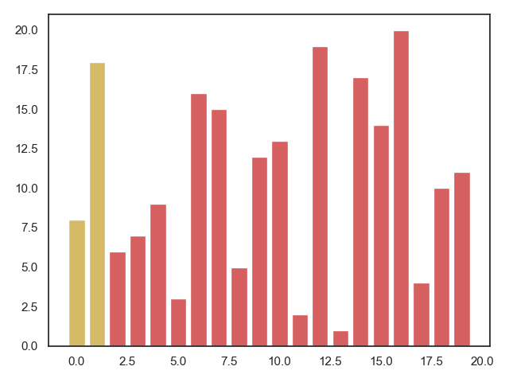
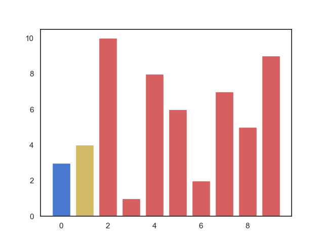
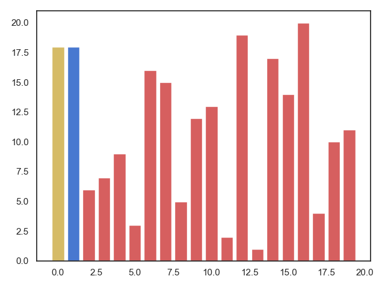
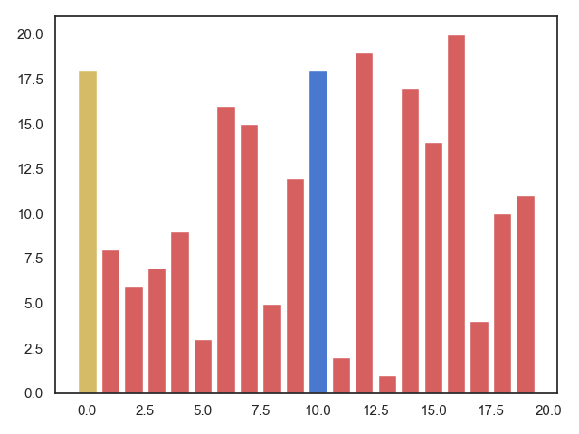
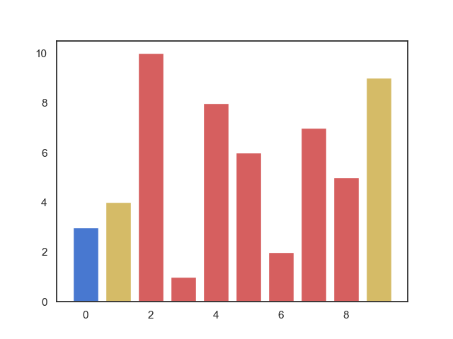
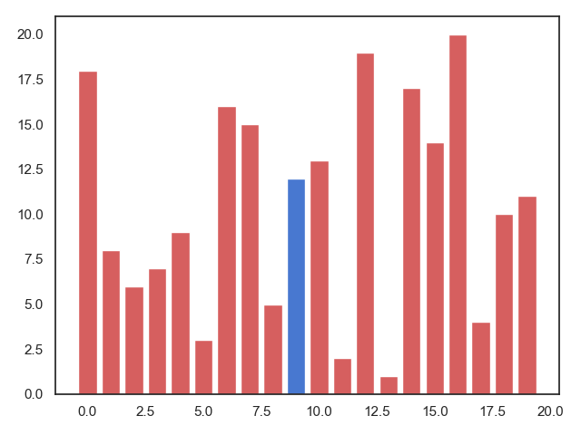

### 各种排序算法的复杂度

| 排序方法     | 时间复杂度（平均） | 时间复杂度（最坏)  | 时间复杂度（最好) | 空间复杂度 | 稳定性 | 复杂性 |
| ------------ | :----------------: | :----------------: | :---------------: | :--------: | :----: | :----: |
| 直接插入排序 |       O(n2)        |       O(n2)        |       O(n)        |    O(1)    |  稳定  |  简单  |
| 希尔排序     |     O(nlog2n)      |       O(n2)        |       O(n)        |    O(1)    | 不稳定 | 较复杂 |
| 直接选择排序 |     O(n2)O(n2)     |       O(n2)        |       O(n2)       |    O(1)    | 不稳定 |  简单  |
| 堆排序       |     O(nlog2n)      |     O(nlog2n)      |     O(nlog2n)     |    O(1)    | 不稳定 | 较复杂 |
| 冒泡排序     |       O(n2)        |     O(n2)O(n2)     |       O(n)        |   O(1))    |  稳定  |  简单  |
| 快速排序     |     O(nlog2n)      |       O(n2)        |     O(nlog2n)     | O(nlog2n)  | 不稳定 | 较复杂 |
| 归并排序     |     O(nlog2n)      | O(nlog2n)O(nlog2n) |     O(nlog2n)     |    O(n)    |  稳定  | 较复杂 |
| 基数排序     |     O(d(n+r))      |     O(d(n+r))      |     O(d(n+r))     |   O(n+r)   |  稳定  | 较复杂 |

### 冒泡排序(bubble sort)

相邻元素比较交换，轻者上浮，重者下沉。
正序时候最快，倒序时候最慢

</img>

### 选择排序(straight select sort)

依次选择最小值进行交换。n-1次选择交换后变成有序表。

</img>

### 插入排序(straight insert sort)

每次从无序表中取出第一个元素，把它插入到有序表的合适位置，使有序表仍然有序。

</img>

### 希尔排序(shell sort)

插入排序算法的改进版本。按照步长插入。

</img>

### 快速排序(quick sort)

又叫划分排序，最快的排序，气泡排序改进版，比较和交换从两端向中间进行。

</img>

### 堆排序(heap sort)

把序列构成一个大根堆，再取出根节点以及对堆进行重构。（详情请看堆的筛运算和对调）

</img>

### 归并排序(merge sort)

把两个有序表合并成一个有序表，需要一个序列长度的辅助空间

### 基数排序(radix sort)

将所有待比较数值统一为同样的数位长度，数位较短的数前面补零。然后，从最低位开始，依次进行一次排序。这样从最低位（个位）排序一直到最高位排序完成以后，数列就变成一个有序序列。